# Android-Map
Understanding depth

Code Style guide :nail_care: - >  https://developer.android.com/kotlin/style-guide

### Philosophy 
Many iterations >>>> looking for perfections

# Kotlin + Android Concepts 

<table>
<tr>
<th>Kotlin Language Concepts</th>
<th>Android-Specific Concepts</th>
</tr>

<tr>
<td valign="top">

### 1. Language Fundamentals
- Variables: `val`, `var`
- Data types: Int, String, Boolean
- Operators: arithmetic, logical, range (`..`)
- Conditionals: `if`, `when`, loops
- String templates
- Smart casting

### 2. Functions & Functional Programming
- Default & named parameters
- Higher-order functions
- Lambdas
- Extension & inline functions
- Scope functions: `let`, `run`, `apply`, `also`, `with`

### 3. Classes & Object-Oriented
- Class declaration, constructors
- Inheritance (`open`, `override`)
- Interfaces, abstract classes
- Data, sealed, enum classes
- Singleton & companion objects
- Nested vs inner classes

### 4. Collections & Data Handling
- Lists, Sets, Maps
- Transformations: `map`, `filter`, `reduce`
- Sequences for lazy evaluation

### 5. Null Safety
- Nullable types (`String?`)
- Safe call (`?.`), Elvis (`?:`), non-null assertion (`!!`)
- `let`, `takeIf`, `takeUnless`

### 6. Coroutines & Concurrency
- `suspend` functions
- Builders: `launch`, `async`, `runBlocking`
- Dispatchers (`Main`, `IO`, `Default`)
- Structured concurrency
- `CoroutineScope`, `Job`, `SupervisorJob`

### 7. Generics & Type System
- Generic functions (`fun <T>`)
- Variance (`in`, `out`)
- Reified types, type aliases

### 8. Exception Handling
- `try`, `catch`, `finally`, `throw`
- Custom exceptions

### 9. Delegation & Advanced
- Property delegation (`by lazy`, `observable`)
- Interface delegation (`class A(b: B): I by b`)

### 10. Java Interoperability
- `@JvmStatic`, `@JvmOverloads`, `@JvmField`
- SAM conversion
- Handling Java nulls

</td>

<td valign="top">

### 11. Android Architecture
- Activity & Fragment lifecycle
- ViewModel for UI persistence
- LiveData / StateFlow
- Lifecycle-aware components
- Navigation component

### 12. Modern Android Patterns
- MVVM / MVI / Clean Architecture
- Repository pattern
- Dependency Injection (Hilt / Dagger)

### 13. UI Development
- XML layouts, ViewBinding, DataBinding
- Jetpack Compose:
  - `@Composable` functions
  - `remember`, `mutableStateOf`
  - `LaunchedEffect`, `SideEffect`
  - State management, `Scaffold`, `LazyColumn`
  - `Modifier` system
- Material theming (`MaterialTheme`, `Typography`)

### 14. Async & Reactive Flows
- Coroutines: `viewModelScope`, `lifecycleScope`
- Flow, StateFlow, SharedFlow
- `repeatOnLifecycle`
- Flow vs LiveData vs RxJava

### 15. Dependency Injection
- Hilt: `@AndroidEntryPoint`, `@Module`, `@Provides`, `@Inject`
- Scopes: `@Singleton`, `@ViewModelScoped`
- Component graph

### 16. Networking & Data
- Retrofit + OkHttp
- Gson / Moshi / Kotlinx.serialization
- Room (`@Entity`, `@Dao`, `@Query`)
- Repository for API + DB
- WorkManager for background jobs

### 17. Compose + Architecture
- State hoisting
- ViewModel + Compose integration
- `collectAsState()`
- `NavHost`, `NavController`

### 18. Testing
- Unit tests: JUnit, Mockito, Truth
- UI tests: Espresso, Compose Testing
- Coroutine testing (`TestDispatcher`, `runTest`)

### 19. Performance & Tools
- Memory management
- Lifecycle leak prevention
- Profilers: Memory, CPU, Network
- StrictMode, ANR watchdog
- Proguard & R8

### 20. Build System & CI/CD
- Gradle (plugins, build variants)
- Kotlin DSL (`build.gradle.kts`)
- Modularization
- CI integration (GitHub Actions, ADO)

### 21. Kotlin Multiplatform
- KMM (shared Android/iOS)
- `expect` / `actual`
- Shared networking & persistence

</td>
</tr>
</table>

# 🧭 Android UI Architecture — Old (View-Based) vs New (Jetpack Compose)

Android UI has evolved from the **imperative XML-based View system** to the **modern Jetpack Compose declarative framework**.  
Below are two color-coded architecture diagrams showing how the design and data flow differ.

---

## 🧱 Old: View-Based Architecture

```mermaid
graph TD
  A["🟦 XML Layouts<br/>(activity_main.xml, fragment_layout.xml)"] --> B["🟩 Activity / Fragment<br/>(findViewById, setText)"]
  B --> C["🟨 ViewModel / Presenter<br/>(Holds data & business logic)"]
  C --> D["🟧 Repository / UseCase<br/>(Data access layer)"]
  D --> E["🟥 Data Sources<br/>(Network / Database)"]

  %% Flow arrows (bottom-up)
  E --> D
  D --> C
  C --> B
  B --> A

  %% Colors and styles
  classDef xml fill:#4fa3ff,stroke:#004a99,color:white;
  classDef activity fill:#68d391,stroke:#276749,color:black;
  classDef viewmodel fill:#f6e05e,stroke:#744210,color:black;
  classDef repo fill:#ed8936,stroke:#7b341e,color:white;
  classDef data fill:#fc8181,stroke:#742a2a,color:white;

  class A xml
  class B activity
  class C viewmodel
  class D repo
  class E data
```

---

## 🌿 New: Jetpack Compose + Clean Architecture

This is the **modern Android app architecture (2025)** —  
built using **Jetpack Compose**, **Kotlin Coroutines**, **StateFlow**, **ViewModel**, and **Clean Architecture** principles.

```mermaid
graph TD
  A["🟩 UI Layer<br/>Jetpack Compose<br/>(@Composable Functions, UI State)"] --> B["🟨 ViewModel<br/>(Holds State, Uses Coroutines & Flow)"]
  B --> C["🟧 Domain Layer<br/>Use Cases / Interactors<br/>(Business Logic)"]
  C --> D["🟫 Data Layer<br/>Repository Pattern<br/>(Abstracts Data Sources)"]
  D --> E["🟥 Data Sources<br/>(Network APIs, Database, Preferences)"]

  %% Reactive flow arrows (bottom-up)
  E --> D
  D --> C
  C --> B
  B --> A

  %% Colors and styles
  classDef ui fill:#68d391,stroke:#276749,color:black;
  classDef vm fill:#f6e05e,stroke:#744210,color:black;
  classDef domain fill:#fbbf24,stroke:#92400e,color:black;
  classDef data fill:#ed8936,stroke:#7b341e,color:white;
  classDef source fill:#fc8181,stroke:#742a2a,color:white;

  class A ui
  class B vm
  class C domain
  class D data
  class E source
```

---

## ⚙️ Key Differences

| **Aspect** | **Old: View-Based Architecture** | **New: Jetpack Compose Architecture** |
|-------------|----------------------------------|----------------------------------------|
| **UI Definition** | XML layouts + imperative Kotlin/Java code | Kotlin Composable functions |
| **Programming Paradigm** | Imperative (tell *how* to update) | Declarative (describe *what* to show) |
| **UI Updates** | Manual (setText, notifyDataSetChanged) | Automatic (state-driven recomposition) |
| **State Handling** | LiveData, Binding | State, remember, Flow |
| **Boilerplate** | More files (XML + Adapters + Binding) | Less code, single Kotlin source |
| **Performance** | View inflation overhead | Optimized Compose runtime |
| **Preview** | Static XML preview | Real-time Compose preview |
| **Reusability** | Custom Views, Fragments | Reusable Composables |
| **Navigation** | Fragment Transactions | Compose Navigation |
| **Recommended By Google** | ✅ Legacy support | 🚀 Official standard for new apps |

---

## 🧩 Summary

- **Old View-Based Architecture:**  
  - Uses XML + imperative updates  
  - Requires manual UI synchronization  
  - More boilerplate code  

- **New Jetpack Compose Architecture:**  
  - Fully Kotlin-based and declarative  
  - Reactive UI with automatic recomposition  
  - Clean, scalable, and testable structure  

> 💡 **Tip:** You can mix both architectures using  
> `ComposeView` (to add Compose in XML) or `AndroidView` (to embed traditional views inside Compose).

---
